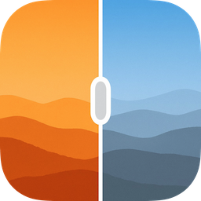

# RSBeforeAfterImageView

A customizable before/after image comparison view for iOS that allows users to interactively compare two images by sliding a divider.



## Features

- Interactive sliding divider with customizable grab handle
- Support for both solid color and blur effect backgrounds
- Customizable grab handle appearance (size, corner radius, border)
- Optional icon support with tint color
- Smooth animations with customizable duration
- Programmatic control of divider position

## Requirements

- iOS 12.0+
- Swift 5.0+
- Xcode 12.0+

## Installation

### CocoaPods

Add the following line to your Podfile:

```ruby
pod 'RSBeforeAfterImageView', :git => 'https://github.com/ricsantos/RSBeforeAfterImageView.git'
```

Then run:

```bash
pod install
```

## Usage

### Basic Setup

```swift
import RSBeforeAfterImageView

class ViewController: UIViewController {
    
    private let beforeAfterView = RSBeforeAfterImageView()
    
    override func viewDidLoad() {
        super.viewDidLoad()
        
        // Add to view hierarchy
        view.addSubview(beforeAfterView)
        
        // Configure with images
        beforeAfterView.configure(
            before: UIImage(named: "before")!,
            after: UIImage(named: "after")!
        )
        
        // Set initial position (optional)
        beforeAfterView.setDividerPosition(0.5, animated: false)
    }
}
```

### Customization

```swift
// Customize grab handle appearance
beforeAfterView.grabHandleSize = CGSize(width: 32, height: 48)
beforeAfterView.grabHandleCornerRadius = 16
beforeAfterView.grabHandleBorderColor = .white
beforeAfterView.grabHandleBorderWidth = 2.0

// Set background style
beforeAfterView.grabHandleBackgroundStyle = .blur(.dark)

// Add an icon
beforeAfterView.grabHandleIcon = UIImage(systemName: "arrow.left.and.right")
beforeAfterView.grabHandleIconTintColor = .white

// Animate to a new position
beforeAfterView.setDividerPosition(0.75, duration: 0.5)
```

## License

This project is available under the MIT license. See the LICENSE file for more info.
